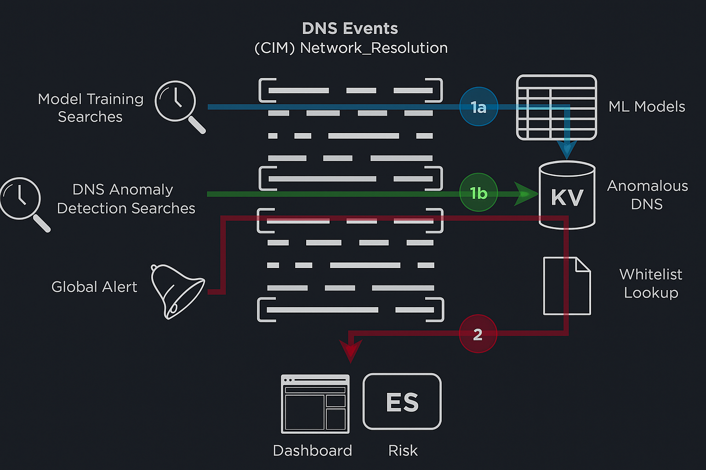
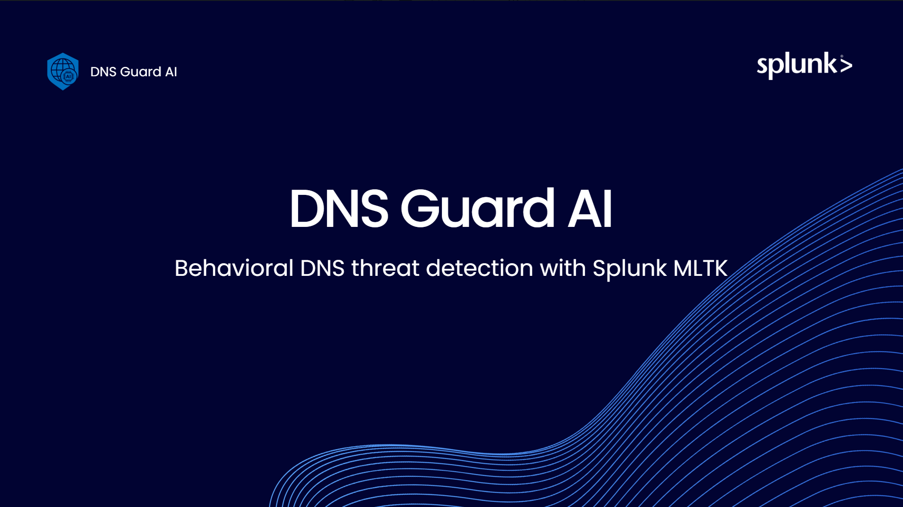
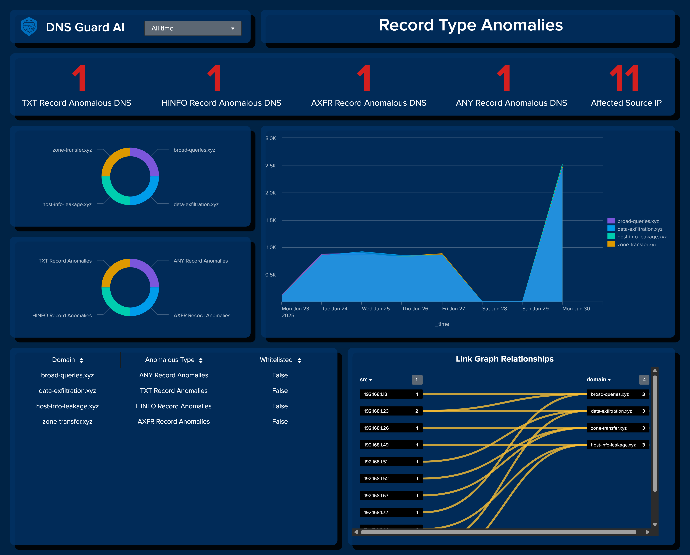
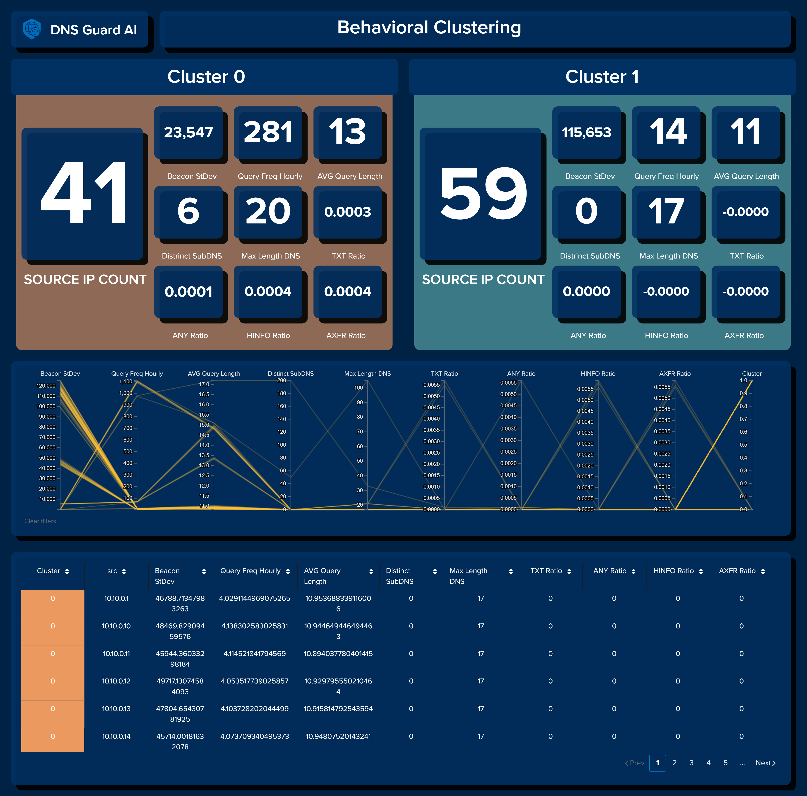
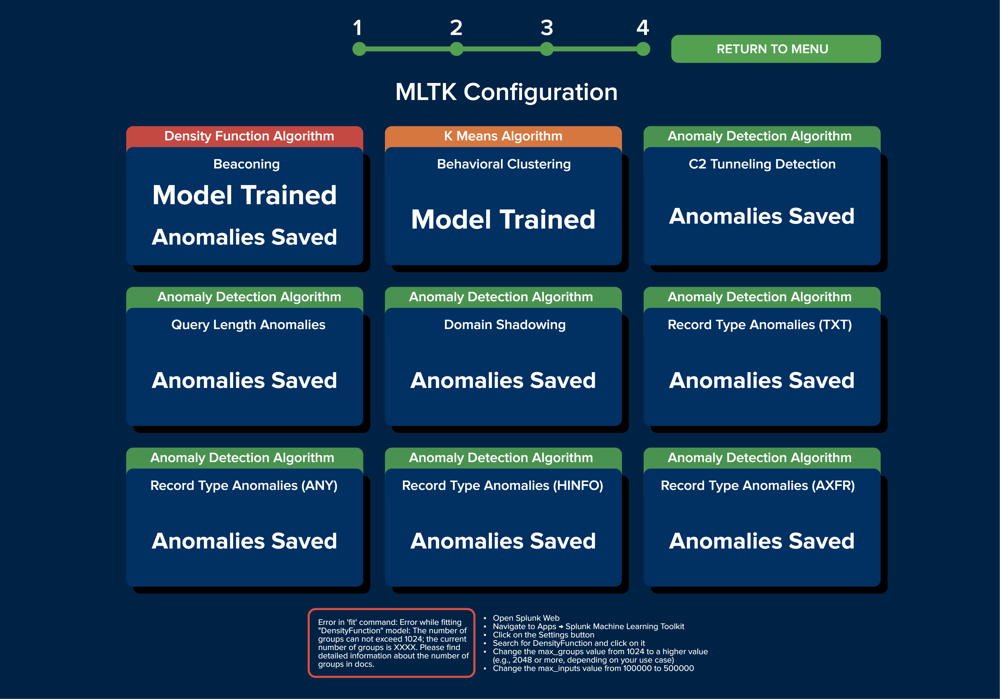

# Splunk DNS Guard AI
A comprehensive DNS anomaly detection system using Splunk and machine learning to identify malicious DNS activity in enterprise networks.

> 🏆 **Splunk Build-a-thon 2025 Entry**  
> This project was developed as part of the [Splunk Build-a-thon 2025](https://www.hackerearth.com/challenges/hackathon/splunk-build-a-thon/#themes) competition, specifically for Track 4: AI/ML. The competition focuses on developing ML-based threat detections inside Splunk using MLTK, bringing data into Splunk and building real-time pipelines to capture threat actors.


<p align="center">
  <a href="#"></a>
  <a href="#"></a>
  <a href="#"></a>
</p>

## Overview

DNS Guard AI is a Splunk App designed to detect various types of DNS anomalies that could indicate malicious activity such as command and control (C2) communication, data exfiltration, or reconnaissance. The system uses Splunk's powerful search capabilities combined with machine learning techniques to identify patterns that deviate from normal DNS behavior.

## Architecture



The architecture shows how DNS Guard AI processes DNS events mapped to the **Network_Resolution** data model in Splunk. **Model training** searches extract features from historical DNS traffic to train machine learning models via the **MLTK** (1a). In parallel, **anomaly detection** searches continuously scan incoming DNS data to identify suspicious behavior such as **exfiltration**, **tunneling**, or **domain shadowing** (1b). Detected anomalies are stored in a **KV Store collection** and compared against a whitelist to suppress false positives. Validated anomalies are then sent to two systems: the **dashboard interface** for visual monitoring, and **Splunk Enterprise Security** (ES) for risk scoring and alert generation (2). This design ensures scalable, real-time DNS threat detection tightly integrated with Splunk’s security ecosystem.

 
## Getting Started

To help you with the setup, a video tutorial covering these exact installation and configuration steps is available on YouTube. You can watch it here:

[](https://www.youtube.com/watch?v=R5Aeuh5ZxxM)

### Installation Steps

Before you begin, make sure you have:

* **Splunk Enterprise/Cloud 8.0+**
* A Splunk machine with at least **16 GB of RAM** for the app to run well.

#### Prerequisites

Install the following apps from Splunkbase:

* [Splunk Common Information Model (CIM)](https://splunkbase.splunk.com/app/1621)
* [Splunk Machine Learning Toolkit](https://splunkbase.splunk.com/app/2890)
* **Python for Scientific Computing**:
     - Choose the appropriate version for your OS:
       - [Linux 64-bit](https://splunkbase.splunk.com/app/2882/)
       - [Windows 64-bit](https://splunkbase.splunk.com/app/2883/)

#### 1. Install the DNS Guard AI App

1.  **Clone the repository:**
    ```bash
    git clone https://github.com/aleeric/Splunk-DNS-Guard-AI.git
    ```
2.  **Move the app folder:** Copy the `Splunk-DNS-Guard-AI/` directory to your Splunk apps directory, typically located at `$SPLUNK_HOME/etc/apps/`.
    ```bash
    mv Splunk-DNS-Guard-AI/Splunk-DNS-Guard-AI $SPLUNK_HOME/etc/apps/
    ```
3.  **Restart Splunk.**

---

### ⚠️ IMPORTANT: POC/TESTING ONLY ⚠️

The following steps (2-5) are **optional** and meant **only for testing and Proof of Concept (POC) purposes**. These steps involve generating and importing synthetic data, which **must never** be performed in a production environment. However, **judges for the Splunk Build-a-Thon competition must follow these steps to properly evaluate the app**. Use these steps exclusively in a dedicated test environment.

---

#### 2. Generate Test Data

1.  **Navigate to the `Synthetic-Data` directory:**
    ```bash
    cd Splunk-DNS-Guard-AI/Synthetic-Data
    ```
2.  **Generate synthetic DNS data:**
    ```bash
    python generate_dns_events.py
    ```
    This will create a new JSON file named **`dns_events.json`**.

#### 3. Import Synthetic Data into Splunk

**Via Splunk Web:**

1.  Go to **Settings** → **Add Data** → **Upload** files from your computer.
2.  **Select File** and choose `dns_events.json`. Click **Next**.
3.  Select **`'synthetic-data'`** from the **Source type** list. Click **Next**.
4.  Set **Host field value** to `'dns-guard-simulator'`.
5.  Create a new index: Set **Index name** to **`'synthetic-data'`** (this is important!). Leave other fields as they are.
6.  Click **Save**, then **Review**, and finally **Submit**.

#### 4. Map to Network\_Resolution Model

1.  Go to **Apps** → **Manage Apps**.
2.  Search for **`'CIM'`** and click **Set up**.
3.  Search for **"Network Resolution"**.
4.  Insert **`'synthetic-data'`** into the **'Indexes allowlist'** field.
5.  Click **Save**.

#### 5. Increase Values on MLTK Settings

1.  Go to **Apps** → **Splunk Machine Learning Toolkit** → **Settings**.
2.  Click **DensityFunction**.
3.  Set **'max\_groups'** value from `5000` to `500000`.
4.  Set **'max\_inputs'** value from `100000` to `10000000`.
5.  Click **Save**.

---

### Verify Setup

Once the app is installed and configured (and synthetic data imported, if applicable), you can verify the setup:

1.  Open **DNS Guard AI** on your Splunk Web Interface.
2.  Go to **setup**.
3.  Navigate to the **'DNS Data Model'** page.
4.  Check that the **'Network Resolution Event Count'** value is **greater than 0**.
5.  Click **Run Query** on all searches in the following order, waiting for each to finish before starting the next:
    * **C2 Tunnel Detection**
    * **Query Length Anomalies**
    * **Domain Shadowing**
    * **Record Type Anomalies (TXT, ANY, HINFO, AXFR)**
    * **Behavioral Clustering**
    * **Beaconing (Upper)**
    * **Beaconing (Lower)**

---

### Synthetic Data Details

For testing and demonstration purposes, the application includes a custom Python script that generates synthetic DNS data specifically for the app’s proof of concept. The generated events adhere to the Common Information Model (CIM), particularly the Network Resolution data model, ensuring compatibility with Splunk’s detection and enrichment features. The synthetic dataset simulates a wide range of DNS anomalies and represents a realistic stream of network activity within an enterprise environment. It includes both benign and malicious DNS behavior to mirror real-world scenarios, making it ideal for evaluating the app’s detection capabilities. These events cover various anomaly types such as beaconing, C2 tunneling, excessive query lengths, rare DNS record types (e.g., ANY, HINFO, AXFR), and domain shadowing—allowing for thorough testing of detection logic under controlled yet representative conditions.

> ⚠️ **REMINDER**: This synthetic data is for testing purposes only and should never be used in a production environment.

## Detection Methods


## Dashboard System

>Here is a preview of the Dashboard System, showcasing selected pages to highlight key features and capabilities.

#### Dashboards - Anomalies Overview


#### Dashboards - Record Type Anomalies



#### Dashboards - Behavioral Clustering



#### Setup - MLTK Configuration



> To explore all the pages and components of the app, visit https://github.com/aleeric/Splunk-DNS-Guard-AI/tree/main/Images/views


